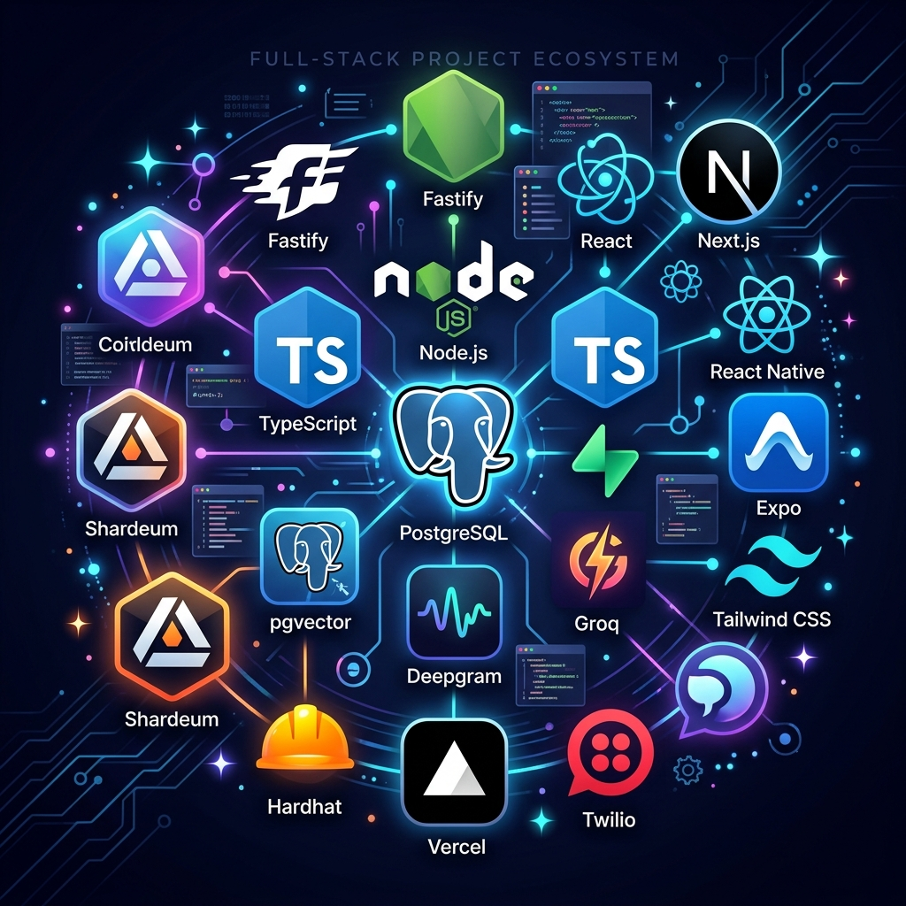

# KisanCall + AgroChain
**Voice‑first procurement coordination with verifiable transaction proof**



---

## 🎯 One‑sentence pitch (SIH 2026)
> **KisanCall** tells the farmer *what is happening* (slot, queue, price, payment) through a simple phone call, while **AgroChain** anchors the critical procurement and payment events on **Supabase PostgreSQL + pgvector** + **Shardeum** to prove *what happened*.

---

## 📚 Project Overview

KisanCall + AgroChain is a **voice‑first farmer‑facing layer** built on top of existing Indian government procurement data (e‑NAM, CFPP) and a **trust layer** that stores cryptographic proofs of key events on the Shardeum blockchain. 

- **Problem** – Farmers must travel to mandis, wait in long queues, and manually check payment status. Existing digital portals are fragmented, and many farmers lack smartphone literacy.
- **Solution** – A multilingual phone‑call interface that:
  1. Registers the farmer (or uses existing Supabase profile).
  2. Books a procurement slot and confirms the government‑reported price.
  3. Sends proactive reminder calls / SMS.
  4. Streams live queue position and ETA.
  5. Updates procurement & payment status in real time.
  6. Writes a **proof record** (hash of selected fields) to the Shardeum blockchain, giving the farmer an immutable reference.

The system works **without a smartphone** – the voice call is the primary UI, with a lightweight web dashboard as a fallback.

---

## ✨ Key Features

| Feature | Description |
|---|---|
| **Voice‑first registration & slot booking** | Natural‑language Hindi/English queries (`mera slot kab hai?`). |
| **Live queue & ETA** | Real‑time queue updates via Supabase Realtime. |
| **Government price lookup** | Latest mandi price from AGMARKNET (date‑stamped). |
| **Payment status tracking** | `PAYMENT_PROCESSING → PAID` spoken in plain language. |
| **Proactive notifications** | Outbound call / SMS reminder before slot time. |
| **Blockchain proof** | Selected events (procurement, payment) hashed and anchored on Shardeum via AgroChain contract. |
| **Multi‑modal fallback** | SMS & optional React‑Native app for low‑connectivity regions. |
| **Role‑based dashboards** | Staff dashboard (Next.js) to update arrivals, queue, procurement, payments. |
| **Zero‑knowledge storage** | Personal data stays in Supabase; only event hashes are on‑chain. |
| **Extensible architecture** | New languages, crops, or states can be added via Supabase tables. |

---

## 🏗️ Technical Stack

| Layer | Technology | Why it fits SIH 2026 |
|---|---|---|
| **Mobile / Web UI** | Expo + React Native (farmer app) <br> Next.js 14 (staff & web dashboards) | Single codebase, fast iteration, Vercel‑ready deployment |
| **Backend** | Fastify + Node.js + TypeScript | Lightweight, high‑performance, matches team expertise |
| **Database** | Supabase (PostgreSQL) <br> **pgvector** extension | Real‑time, auth, and vector‑search ready for future RAG layer |
| **Voice pipeline** | Twilio (prototype) / Indian‑compliant provider <br> Deepgram STT <br> Groq LLM (fast, low‑latency) <br> Deepgram Aura / Flux TTS | Sub‑second latency, multilingual support |
| **Blockchain** | Shardeum EVM testnet <br> Hardhat + Solidity contract (`ProofRegistry`) | Low‑cost proof anchoring, compatible with Ethereum tooling |
| **Monorepo tooling** | Turborepo + PNPM workspaces | Shared configs, fast dev‑server (`pnpm dev`) |
| **Styling** | Tailwind CSS (dashboards) | Rapid UI building, dark‑mode ready |
| **Hosting** | Vercel (Next.js) <br> Render / Render‑like for backend (optional) | Free tier sufficient for the SIH prototype |
| **Monitoring** | Sentry (optional) | Capture runtime errors in the demo |

---

## 👨‍👩‍👧‍👦 Team

| Member | Role |
|---|---|
| **Krishna** | Backend & Voice‑AI lead |
| **Vansh** | Mobile & Expo lead |
| **Aarushi** | Voice‑AI tooling & prompts |
| **Navya** | Staff & Web Dashboard UI/UX |
| **Mehar** | Design & AgroChain smart‑contract |
| **Aarush** | Shardeum integration & blockchain |

*(Add team photos in `design/teammates/` and reference them here if desired.)*

---

## 📦 Installation

```bash
# 1️⃣ Clone the repo
git clone https://github.com/krix2112/kisansaarthi.git
cd kisansaarthi

# 2️⃣ Install all workspaces (requires Node 20+ & pnpm 9+)
pnpm install

# 3️⃣ Set up environment variables
cp .env.example .env
# Edit .env with your Supabase URL / service key, Deepgram API key, etc.

# 4️⃣ Run the full stack (development)
pnpm dev
```

The `pnpm dev` command starts Fastify, Next.js dashboards, Expo dev‑client, and Hardhat watch mode concurrently.

---

## 🚀 Quick Demo
1. **Call the number** (Twilio test number or simulated call). 
2. The AI greets in Hindi: “Namaste! Aapka slot 12 Aug 2026, 09:30 AM hai, price ₹1910/kg (date 12‑Aug).”
3. Ask “Mera queue kya hai?” → the system replies with the live position and ETA.
4. Staff marks **ARRIVED → PROCURED → PAYMENT_PAID** on the staff dashboard.
5. A proof hash is written to Shardeum, and the farmer receives the transaction reference via voice and SMS.

All steps complete in **≤ 1.5 seconds** perceived latency (STT ≈ 300 ms, LLM ≈ 400 ms, TTS ≈ 300 ms).

---

## 📡 API Endpoints (core)

| Method | Path | Description |
|---|---|---|
| `POST` | `/farmers` | Register a new farmer (or upsert existing). |
| `POST` | `/bookings` | Create a slot booking. |
| `GET` | `/farmers/:id/queue` | Current queue position & ETA. |
| `GET` | `/farmers/:id/status` | Procurement & payment status. |
| `GET` | `/mandis/:id/prices` | Latest government‑reported mandi price (date‑stamped). |
| `POST` | `/staff/arrivals` | Record farmer arrival at centre. |
| `POST` | `/staff/procurement` | Record weight, quality, create proof event. |
| `PATCH` | `/payments/:id` | Update payment status. |
| `POST` | `/voice/webhook` | Twilio inbound webhook – routes to tool handlers. |
| `POST` | `/voice/tool/get-slot` | Tool for slot lookup. |
| `POST` | `/voice/tool/get-queue` | Tool for live queue. |
| `POST` | `/voice/tool/get-price` | Tool for mandi price. |
| `POST` | `/voice/tool/get-payment` | Tool for payment status. |
| `POST` | `/proof-events` | Store proof hash on‑chain (AgroChain). |
| `GET` | `/proof/:id` | Retrieve on‑chain proof details. |

---

## 🏛️ Architecture Diagram

*(Add a Mermaid diagram in `docs/architecture.mmd` later.)*

```mermaid
graph LR
    A[Farmer Phone] -->|Voice Call| B[Twilio ↔ Fastify Backend]
    B --> C[Supabase PostgreSQL + pgvector]
    B --> D[Deepgram STT]
    D --> E[Groq LLM]
    E --> F[Deepgram TTS]
    B --> G[AgroChain Smart Contract (Shardeum)]
    G --> H[ProofRegistry.sol]
    C --> I[Staff Dashboard (Next.js)]
    C --> J[Mobile App (Expo)]
```

---

## 📈 Roadmap (first 4 weeks – MVP)

| Week | Milestone | Success Criteria |
|---|---|---|
| **1** | DB schema, auth, staff‑dashboard shell, price‑API adapter | Farmer + slot + queue data flow end‑to‑end. |
| **2** | Voice pipeline (STT → tool → LLM → TTS) for Hindi/English | 5‑10 scripted phone conversations work without errors. |
| **3** | Procurement lifecycle, AgroChain proof creation, SMS fallback | Every procurement creates a blockchain hash; SMS shows proof ID. |
| **4** | Polish UI, load‑test queue handling, demo script, metrics dashboard | 3‑minute demo never breaks; metrics (calls, ETA accuracy) collected. |

---

## 🏆 Why This Wins SIH 2026
* **Focused USP** – Voice‑first farmer experience **plus** cryptographic proof of procurement / payment.
* **Leverages Government Stack** – Uses publicly available e‑NAM & CFPP data; no claim of replacing them.
* **Low‑cost Prototype** – Supabase free tier, Vercel hobby, Shardeum testnet, only modest telephony usage.
* **Clear Demo Flow** – End‑to‑end call → queue update → proof generation → payment confirmation, all audible to judges.

---

## 📄 Documentation
* `docs/DB_SCHEMA.md` – Full table definitions (including `knowledge_base`).
* `docs/API_CONTRACT.md` – Detailed request/response schemas.
* `docs/PLAN.md` – Execution plan and timeline.
* `README.md` – This file (project‑level overview).

---

## 📜 License
MIT – see `LICENSE` file.

---

## 🙋‍♀️ Contact
* **Project Lead (Krishna)** – krish211207@gmail.com
* **GitHub** – https://github.com/krix2112/kisansaarthi

Feel free to open issues or PRs – we welcome contributions!
