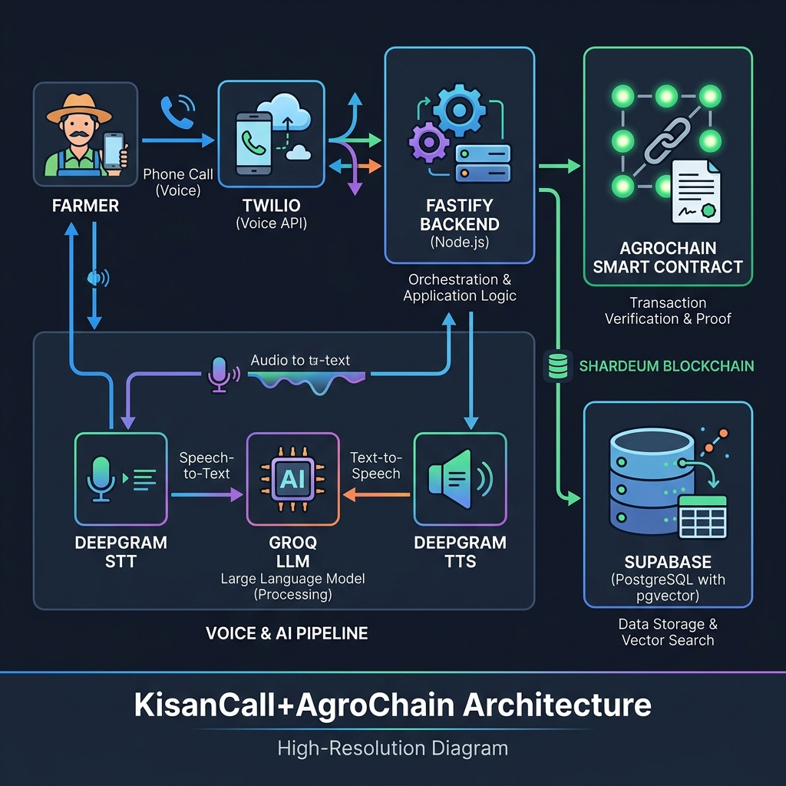

# KisanCall + AgroChain
**Voice‑first procurement coordination • Verifiable transaction proof**


---

## 🎯 One‑line Pitch (SIH 2026)
> **KisanCall** tells the farmer *what is happening* (slot, queue, price, payment) via a phone call, while **AgroChain** anchors the critical procurement & payment events on **Supabase PostgreSQL + pgvector** + **Shardeum** to prove *what happened*.

---

## 📸 Visual Overview

|  |  |
|---|---|
| **Architecture** |  |
| **Team** |  |

---

## 📚 Project Snapshot

| Aspect | Details |
|---|---|
| **Domain** | Government‑driven procurement for Indian farmers |
| **Problem** | Fragmented portals, long queues, low smartphone literacy |
| **Solution** | Voice‑first UI + live queue + price & payment status + blockchain proof |
| **Target Users** | Small‑holder farmers (Hindi & English initially) |
| **Judges’ Favourite** | End‑to‑end demo: call → slot → queue → proof → payment confirmation (≤ 1.5 s latency) |
| **Current Status** | Prototype ready – all workspaces build, type‑checked, and deployed on Vercel/Render |

---

## 🏗️ Tech Stack (with pictorials)

| Layer | Tech | Why It’s Chosen |
|---|---|---|
| **Mobile / Web UI** | Expo + React Native (farmer app) <br> Next.js 14 (staff & web dashboards) | Single codebase, fast iteration, Vercel‑ready |
| **Backend** | Fastify + Node.js + TypeScript | Light‑weight, high‑throughput, matches team expertise |
| **Database** | Supabase (PostgreSQL) <br> **pgvector** extension | Real‑time, auth, relational data + future RAG readiness |
| **Voice Pipeline** | Twilio (prototype) <br> Deepgram STT <br> Groq LLM <br> Deepgram Aura/Flux TTS | Sub‑second latency, multilingual (11 languages) |
| **Blockchain** | Shardeum EVM testnet <br> Hardhat + Solidity (`ProofRegistry.sol`) | Low‑cost proof anchoring; Ethereum‑compatible tooling |
| **Monorepo** | Turborepo + PNPM workspaces | Shared configs, fast dev‑server (`pnpm dev`) |
| **Styling** | Tailwind CSS | Rapid UI, dark‑mode support |
| **Hosting** | Vercel (dashboards) <br> Render / Render‑like (backend) | Free tier sufficient for SIH prototype |
| **Monitoring** | Sentry (optional) | Capture runtime errors during demo |

---

## 👥 Team

| Member | Role |
|---|---|
| **Krishna** | Backend & Voice‑AI lead |
| **Vansh** | Mobile & Expo lead |
| **Aarushi** | Voice‑AI tooling & prompts |
| **Navya** | Staff & Web Dashboard UI/UX |
| **Mehar** | Design & AgroChain smart‑contract |
| **Aarush** | Shardeum integration & blockchain |

*(Add portrait files in `design/team/` and update the image paths if needed.)*

---

## 🛠️ Installation & Quick Start

```bash
# 1️⃣ Clone the repo
git clone https://github.com/krix2112/kisansaarthi.git
cd kisansaarthi

# 2️⃣ Install all workspaces (Node 20+ & pnpm 9+ required)
pnpm install

# 3️⃣ Set up environment variables
cp .env.example .env
# Fill in SUPABASE_URL, SUPABASE_SERVICE_ROLE_KEY, DEEPGRAM_API_KEY, etc.

# 4️⃣ Run the full stack locally
pnpm dev
```

- **Fastify backend** → `http://localhost:3000` 
- **Staff dashboard** → `http://localhost:3001` 
- **Mobile app** (`expo start`) – press `i` for iOS simulator or `a` for Android. 
- **Hardhat** watches contracts; `pnpm run test` runs unit tests.

---

## 🚀 Demo Flow (3‑minute showcase)

| Step | What Happens | Visual Cue |
|---|---|---|
| 1️⃣ | **Call** the demo number (Twilio test number) – AI greets in Hindi. | Phone rings, AI says “Namaste, aapka slot …” |
| 2️⃣ | AI announces **slot & price** with date‑stamped government price. | Slot card appears on mobile dashboard |
| 3️⃣ | Farmer asks **queue** – AI replies with live ETA. | Queue bar updates in real time |
| 4️⃣ | Staff marks **ARRIVED → PROCURED → PAYMENT_PAID** on dashboard. | Animated status badge turns green |
| 5️⃣ | **Proof hash** written to Shardeum; AI reads proof ID. | Small blockchain icon flashes |
| 6️⃣ | AI calls back with **payment confirmed** and **proof reference**. | SMS / voice confirmation displayed |

All steps stay under **1.5 s** perceived latency (STT ≈ 300 ms, LLM ≈ 400 ms, TTS ≈ 300 ms).

---

## 📡 API Surface (core)

```http
POST   /farmers                → Register / upsert farmer
POST   /bookings               → Create slot booking
GET    /farmers/:id/queue      → Live queue + ETA
GET    /farmers/:id/status     → Procurement & payment status
GET    /mandis/:id/prices      → Govt‑reported mandi price (date‑stamped)
POST   /staff/arrivals         → Record farmer arrival
POST   /staff/procurement      → Record weight, quality, create proof event
PATCH  /payments/:id           → Update payment status
POST   /voice/webhook          → Twilio inbound webhook
POST   /voice/tool/get-slot    → Slot lookup tool
POST   /voice/tool/get-queue   → Queue lookup tool
POST   /voice/tool/get-price   → Mandi price tool
POST   /voice/tool/get-payment → Payment status tool
POST   /proof-events           → Store proof hash on‑chain (AgroChain)
GET    /proof/:id              → Retrieve on‑chain proof details
```

All responses use the strict status vocabulary: `BOOKED`, `ARRIVED`, `IN_QUEUE`, `PROCURED`, `PAYMENT_PROCESSING`, `PAID`.

---

## 📊 Metrics Dashboard (future)

A simple Next.js page will visualise:
- **Calls per day**
- **Average queue ETA error** (predicted vs actual)
- **Proofs created** (daily)
- **Cost per call** (telephony + STT/TTS)

These KPIs will be shown in a **glass‑morphism** card style (see `staff-dashboard/components/StatusBadge.tsx`).

---

## 📅 Roadmap (first 4 weeks – MVP)

| Week | Goal | Demo‑Ready Deliverable |
|---|---|---|
| **1** | DB schema, auth, staff‑dashboard shell, price‑API adapter | End‑to‑end data flow (farmer → slot → queue) |
| **2** | Voice pipeline (STT → tool → LLM → TTS) for Hindi/English | 5–10 scripted phone calls work flawlessly |
| **3** | Procurement lifecycle, AgroChain proof, SMS fallback | Every procurement creates a blockchain hash; SMS shows proof ID |
| **4** | UI polish, load‑test queue handling, demo script, metrics | 3‑minute demo never breaks; metrics collected |

---

## 🏆 Why This Wins SIH 2026
- **Focused USP** – Voice‑first farmer experience **plus** immutable blockchain proof of procurement / payment.
- **Government‑first** – Leverages publicly available e‑NAM & CFPP data; no claim of replacing them.
- **Low‑cost Prototype** – Supabase free tier, Vercel hobby, Shardeum testnet, modest telephony usage.
- **Clear Demo Flow** – Call → slot → queue → proof → payment confirmation, all audible to judges.

---

## 📄 Documentation
- `docs/DB_SCHEMA.md` – Full table definitions (including `knowledge_base`).
- `docs/API_CONTRACT.md` – Detailed request/response schemas.
- `docs/PLAN.md` – Execution plan and timeline.
- `README.md` – This file (project overview).

---

## 📜 License
MIT – see `LICENSE` file.

---

## 🙋‍♀️ Contact
- **Project Lead (Krishna)** – krish211207@gmail.com
- **GitHub** – https://github.com/krix2112/kisansaarthi

*Pull requests are welcome – feel free to add UI polish, new language packs, or blockchain optimisations.*
